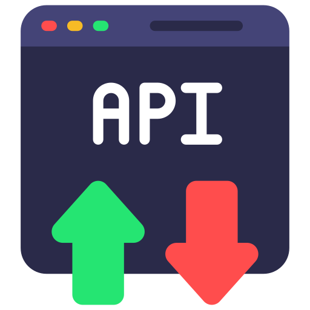

## Mkt Gus   

O MKTGus é um software de autoatendimento desenvolvido para oferecer uma experiência rápida, simples e intuitiva.
Diferente dos modelos tradicionais, ele traz um novo sistema de pontuação, pensado para engajar usuários e tornar cada interação mais dinâmica.

Com foco em agilidade e usabilidade, o MKTGus se destaca por ser um dos sistemas mais práticos da categoria, reunindo eficiência e inovação em uma solução leve e moderna.

Confira o código e veja como essa ideia foi estruturada! 👀 🔍 📂

[COLOCAR LOGO]

 
 

## Funcionalidades
-  Scanear produtos pelo Celular
-  Barcode usado para converter código de barras em números
-   Os números usados para pesquisa na API
-  Se o produto estiver no banco de dados ele puxa do banco, se não pega da API
-  Carrinho de compra
-  Finaliza Compra

 
 

## Stack utilizada

**Front-end:** React, JavaScript, TypeScript

**Back-end:**

 Java
 IntelliJ 
 SpringBoot
 Supabase

